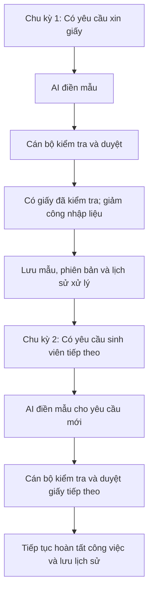

# Track1_Day20_2A202602523_HoangQuocDung

- **Họ tên:** Hoàng Quốc Dũng
- **Mã học viên:** 2A202602523
- **Dự án:** Campus 24/7 — Trợ lý hỗ trợ xử lý yêu cầu học vụ
- **Metrics Pack:** [Xem bài làm](#metrics-pack)
- **AI Support Log:** [ai-support-log.md](ai-support-log.md)

## 00 — Dự án, persona, core job

| Mục | Nội dung |
|---|---|
| Dự án | Campus 24/7 — AI điền biểu mẫu xin giấy để cán bộ kiểm tra, duyệt. |
| Persona | Cán bộ học vụ kiểm tra và duyệt giấy tờ sinh viên yêu cầu. |
| Core job | “Tôi muốn duyệt giấy nhanh, đúng thông tin, giảm nhập liệu thủ công.” |

## 01 — Core Action

### Phân biệt bốn khái niệm

| Khái niệm | Nội dung |
|---|---|
| Core job | Duyệt giấy nhanh, đúng thông tin, giảm nhập liệu thủ công. |
| Core action | Cán bộ kiểm tra và xác nhận bản giấy đã điền đúng, đủ. |
| Core value | Có bản giấy đã kiểm tra, giảm công điền tay. |
| Core value event | `document_review_approved`: quyết định duyệt đúng phiên bản giấy đã được lưu. |

### Core Action Card

| Thành phần | Nội dung |
|---|---|
| Target user | Cán bộ học vụ phụ trách yêu cầu cấp giấy xác nhận sinh viên. |
| Core job | Duyệt giấy nhanh, đúng thông tin, giảm nhập liệu thủ công. |
| Core action | Kiểm tra, sửa nếu cần và xác nhận bản giấy đúng, đủ. |
| Object | Một bản giấy xác nhận được AI điền theo mẫu từ yêu cầu sinh viên. |
| Preconditions | Có yêu cầu, mẫu hợp lệ, thông tin đối chiếu và cán bộ đủ quyền duyệt. |
| Completion rule | Cán bộ kiểm tra các mục bắt buộc; xác nhận đúng phiên bản; quyết định lưu thành công. |
| Core value | Bản giấy sẵn sàng cho bước cấp, giảm công nhập liệu thủ công. |
| Evidence of value | Bản giấy đã duyệt, kết quả kiểm tra, người duyệt và thời điểm duyệt. |
| Candidate event | `document_review_approved`. |

### Tự kiểm năm tiêu chí

| Tiêu chí | Kết quả | Lý do |
|---|---|---|
| Gần core value | Đạt | Có bản giấy được kiểm tra, sẵn sàng cho bước cấp. |
| Có thể lặp lại | Đạt | Yêu cầu mới tạo công việc kiểm tra mới. |
| Có thể quan sát | Đạt | Có quyết định duyệt lưu cho phiên bản cụ thể. |
| Có ý nghĩa | Đạt | Giấy duyệt đúng, đủ giúp hoàn tất công việc; cần kiểm soát lỗi sau duyệt. |
| Có thể tác động | Đạt | Cải thiện điền mẫu, đối chiếu dữ liệu và giao diện kiểm tra. |

## 02 — Nature & cadence

### Action Nature Card

| Thành phần | Nội dung |
|---|---|
| Actor | Cán bộ học vụ được giao hồ sơ. |
| Intent | Hoàn tất yêu cầu cấp giấy chính xác, giảm nhập liệu lặp lại. |
| Trigger | Yêu cầu sinh viên mới hoặc hồ sơ tồn trong hàng chờ. |
| Effort | Đọc, đối chiếu, sửa nếu cần và duyệt; đo bằng thời gian thao tác. |
| Value timing | Có bản giấy đã kiểm tra ngay sau duyệt; tiết kiệm công tích lũy qua nhiều hồ sơ. |
| State | Phiên bản giấy, mẫu sử dụng, trường đã sửa và lịch sử duyệt. |
| Dependency | Dữ liệu đầu vào, mẫu hợp lệ, quyền cán bộ và lịch phân công. |
| Repeat condition | Có bản giấy tiếp theo cần kiểm tra. |

## 03 — Metric System

### Activation

| Thành phần | Định nghĩa |
|---|---|
| Start event | `document_review_assigned` đầu tiên: bản giấy sẵn sàng được giao cho cán bộ. |
| Activation event | `document_review_approved` đầu tiên, đáp ứng completion rule. |
| Time window | Từ lúc được giao đến hết ca có thể xử lý đầu tiên; giao ngoài ca thì tính ca kế tiếp. |
| Activation rate | Cán bộ duyệt giấy đầu trong cửa sổ / cán bộ được giao giấy đầu và đã kết thúc cửa sổ. |

### Engagement

| Góc đo | Metric |
|---|---|
| Frequency | Số yêu cầu có giấy được duyệt duy nhất trên mỗi ca có hồ sơ; báo cáo kèm workload. |
| Depth | Tỷ lệ giấy duyệt không cần sửa tay = giấy không sửa trước duyệt / tổng giấy đã duyệt. |

### North Star Metric

**Số yêu cầu có bản giấy được cán bộ xác nhận đúng, đủ theo mẫu trong mỗi ca làm việc có hồ sơ.**

- **Unit of value:** Một yêu cầu có bản giấy được cán bộ kiểm tra và duyệt.
- **Quality threshold:** Đạt các mục kiểm tra bắt buộc, thông tin khớp dữ liệu đối chiếu, đúng mẫu.
- **Frequency:** Theo ca có hồ sơ; mỗi yêu cầu tính một lần dù có nhiều phiên bản.

### Leading indicators

| Chỉ số | Cách tính | Vì sao dự báo core action lặp lại |
|---|---|---|
| Tỷ lệ giấy không cần sửa tay | Giấy duyệt không sửa tay / tổng giấy đã duyệt. | Ít chỉnh sửa giảm công, khuyến khích cán bộ tiếp tục dùng. |
| Thời gian thao tác kiểm tra | Tổng thời gian kiểm tra chủ động trước duyệt; báo cáo trung vị và p90. | Kiểm tra nhanh với chất lượng ổn định tăng lợi ích sử dụng. |
| Tỷ lệ duyệt trong ca đầu | Hồ sơ duyệt trong ca có thể xử lý đầu / hồ sơ đã kết thúc cửa sổ. | Ít tồn đọng giúp workflow thuận tiện và được dùng tiếp. |

### Counter-metrics

| Chỉ số | Cách tính |
|---|---|
| Tỷ lệ giấy có lỗi sau duyệt | Yêu cầu có lỗi được xác nhận trong 7 ngày / yêu cầu đã duyệt đủ 7 ngày quan sát. |
| Tỷ lệ bản giấy bị trả lại | Yêu cầu bị trả lại / yêu cầu đã có quyết định đầu tiên, duyệt hoặc trả lại. |
| Số trường sửa tay trên mỗi giấy | Tổng trường sửa duy nhất trước duyệt / số giấy đã duyệt. |

Thời gian thao tác loại thời gian chờ và tạm dừng. Hồ sơ chưa đủ 7 ngày theo dõi được tách khỏi mẫu số lỗi. Hiệu quả giảm nhập liệu cần so với quy trình điền tay cùng loại giấy và workload.

## 04 — Retention Definition

| Thành phần | Định nghĩa |
|---|---|
| Unit | Cán bộ duy nhất theo `officer_id`. |
| Cohort entry | Lần duyệt giấy hợp lệ đầu tiên; gom cohort theo tuần lần duyệt đầu. |
| Return event | `document_review_approved` cho một yêu cầu khác, do cùng cán bộ thực hiện. |
| Window | Ca được phân công tiếp theo có hồ sơ khác cần kiểm tra, trong 30 ngày sau activation. |
| Threshold | Ít nhất một giấy của yêu cầu khác được duyệt trong ca đó. |
| Segment | Cán bộ học vụ có quyền duyệt giấy xác nhận và có hồ sơ được giao; loại bot, nội bộ, demo. |

**Retention rate:** Cán bộ có return event đạt ngưỡng / cán bộ có ca tiếp theo đủ điều kiện đã kết thúc.

Ca đủ điều kiện được xác định từ lịch và phân công, kể cả cán bộ không mở ứng dụng. Ca không có hồ sơ, thiếu dữ liệu phân công hoặc chưa kết thúc không tính vào mẫu số. Duyệt lại cùng yêu cầu không tính là quay lại.

**Ba mốc đối chiếu:** Nhịp ca và workload thực tế; cohort cùng vai trò/loại giấy; benchmark workflow học vụ có định nghĩa tương đương khi có dữ liệu.

## 05 — Product Loop

**Loại loop:** Workflow.

**Reason to return:** Có hồ sơ tiếp theo cần xử lý; mẫu và lịch sử đã lưu hỗ trợ workflow.

**Metric hypothesis:** Nếu loop này hoạt động, retention của cán bộ ở ca có hồ sơ tiếp theo sẽ tăng trong 30 ngày, vì giấy điền sẵn giảm nhập liệu nhưng cán bộ vẫn kiểm soát chất lượng.

## 06 — Tracking nhanh

| Event | Ý nghĩa | Thời điểm ghi nhận | Metric sử dụng |
|---|---|---|---|
| `document_review_assigned` | Bản giấy sẵn sàng được giao cho cán bộ. | Sau khi bản giấy và phân công được lưu thành công. | Start activation; workload; ca đủ điều kiện retention; tỷ lệ duyệt trong ca đầu. |
| `document_review_started` | Cán bộ bắt đầu lượt kiểm tra chủ động. | Khi bắt đầu kiểm tra bản giấy, tạo mã lượt kiểm tra. | Thời gian thao tác kiểm tra. |
| `document_review_ended` | Lượt kiểm tra đã kết thúc hoặc tạm dừng. | Khi kết thúc/tạm dừng lượt kiểm tra, lưu thời lượng thao tác. | Thời gian thao tác kiểm tra. |
| `document_manual_edit_saved` | Cán bộ đã lưu sửa đổi nội dung giấy. | Sau khi lưu phiên bản có thay đổi thực tế, kèm các trường sửa. | Depth; tỷ lệ không sửa tay; số trường sửa. |
| `document_review_approved` | Cán bộ đã xác nhận giấy đúng, đủ. | Sau khi lưu quyết định duyệt hợp lệ cho phiên bản hiện tại. | Activation; engagement; NSM; retention; tỷ lệ duyệt trong ca đầu. |
| `document_revision_requested` | Cán bộ đã trả giấy để sửa/bổ sung. | Sau khi lưu quyết định trả lại và lý do. | Counter tỷ lệ bản giấy bị trả lại. |
| `document_postapproval_error_confirmed` | Lỗi sau duyệt đã được xác nhận. | Sau khi lưu lỗi có bằng chứng, gắn đúng bản giấy đã duyệt. | Counter tỷ lệ lỗi sau duyệt. |

### Tiêu chí nghiệm thu

1. Chỉ ghi `document_review_approved` khi quyết định duyệt được lưu thành công cho đúng cán bộ, yêu cầu và phiên bản. Bấm nút nhưng lưu lỗi không tạo event thành công.
2. Reload/retry không tạo thêm event cho cùng quyết định duyệt. Autosave không đổi nội dung không tạo event sửa giấy.
3. Mỗi yêu cầu tính một lần cho sản lượng; duyệt lại cùng yêu cầu không tạo return event retention.
4. Mỗi event gắn mã cán bộ, yêu cầu và phiên bản. Thời gian kiểm tra ghép theo mã lượt, loại thời gian tạm dừng.