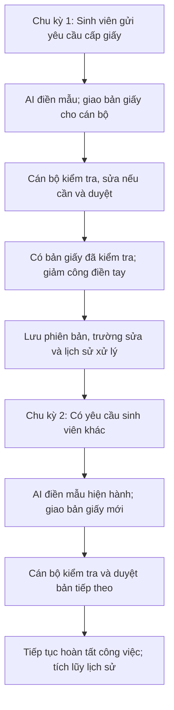

# Track1_Day20_2A202602523_HoangQuocDung

**Bài cá nhân Day 20 — Product Metrics, Retention & Product Loop**

| Thông tin | Nội dung |
|---|---|
| Họ tên | Hoàng Quốc Dũng |
| Mã học viên | 2A202602523 |
| Ngày biên soạn | 06/10/2026 |
| Dự án áp dụng | Campus 24/7 — Trợ lý hỗ trợ xử lý yêu cầu học vụ, EDU-14 / P-120 |
| Persona chính của bài lab | Cán bộ học vụ tiếp nhận và xử lý yêu cầu sinh viên |
| Use case | Kiểm tra và duyệt giấy xác nhận được AI điền sẵn theo mẫu |
| Metrics Pack | [Đọc Metrics Pack trong README này](#metrics-pack) |
| AI Support Log | [ai-support-log.md](ai-support-log.md) |

**Phạm vi đã được người nộp làm rõ:** Sinh viên xin giấy; giấy có mẫu sẵn; AI điền thông tin để cán bộ đọc lại và duyệt, giảm nhập liệu thủ công. Sinh viên là người yêu cầu dịch vụ, còn cán bộ là persona được phân tích trong bài này.

**Trạng thái:** Phase 0 bám theo lựa chọn và mô tả của người nộp. Các phương án core action, cadence, metric, retention và loop bên dưới là bản đề xuất để người nộp tự rà soát từng phase. Chưa có số liệu thực đo, baseline hoặc kết quả nghiệm thu. Mô tả điền biểu mẫu do người nộp cung cấp là hướng sản phẩm cần phân tích, chưa được xác nhận đã triển khai trong code.

Metrics Pack dùng bảng và sơ đồ ngay trong README để đọc độc lập trên GitHub. [Link GitHub của Metrics Pack](https://github.com/QuocDzungH/Track1_Day20_2A202602523_HoangQuocDung/blob/main/README.md#metrics-pack) sẽ phản ánh bản mới sau khi cập nhật repository; quyền xem chưa được xác minh.

`P-120` chỉ là bản sao dự án để tham khảo, không thuộc hồ sơ nộp bài cá nhân. Nội dung dưới đây không cần truy cập thư mục đó để hiểu.

## Điều mang về áp dụng cho dự án thật

Các hướng áp dụng đề xuất để người nộp rà soát:

- Đo số giấy được cán bộ kiểm tra và xác nhận đúng, đủ; số bản nháp AI tạo chỉ là đầu vào.
- Đo lượng thông tin cán bộ phải sửa và thời gian thao tác, để kiểm chứng lợi ích giảm nhập liệu.
- Đánh giá cán bộ quay lại khi có hồ sơ mới cần xử lý; ca không có hồ sơ không chứng minh churn.
- Tăng tốc duyệt phải đi cùng chất lượng; theo dõi giấy phải sửa sau duyệt để tránh duyệt nhanh nhưng sai.

## Metrics Pack

### 00 — Dự án, persona, core job

| Mục | Nội dung |
|---|---|
| Dự án | Campus 24/7 — AI điền biểu mẫu học vụ để cán bộ kiểm tra, duyệt. |
| Persona | Cán bộ học vụ tiếp nhận và xử lý yêu cầu sinh viên. |
| Core job | “Tôi muốn duyệt giấy nhanh, đúng thông tin, giảm nhập liệu thủ công.” |
| Use case | Giấy xác nhận sinh viên có mẫu sẵn, được AI điền từ thông tin yêu cầu. |
| Luồng | Sinh viên yêu cầu → AI điền mẫu → cán bộ kiểm tra/sửa → xác nhận bản giấy. |

Bài này tập trung vào công việc cán bộ với giấy xác nhận. Khiếu nại, đặt phòng và hỏi đáp quy chế là các use case khác, không gộp vào bộ metric này. “Duyệt bản giấy” là xác nhận nội dung sẵn sàng cho bước cấp giấy theo quy trình; chưa đồng nghĩa đã ký, phát hành hoặc sinh viên đã nhận giấy.

### 01 — Core Action Card

**Ứng viên đề xuất:** Cán bộ kiểm tra, chỉnh sửa nếu cần và xác nhận một bản giấy AI điền sẵn đúng, đủ theo mẫu.

#### Phân biệt bốn khái niệm

| Khái niệm | Áp dụng vào use case |
|---|---|
| Core job | Duyệt giấy nhanh, đúng thông tin, giảm nhập liệu thủ công. |
| Core action | Cán bộ kiểm tra và xác nhận bản giấy đã điền đúng, đủ. |
| Core value | Có bản giấy sẵn sàng cho bước cấp, giảm công điền tay. |
| Core value event | `document_review_approved`: xác nhận của cán bộ đã được lưu cho đúng phiên bản giấy. |

AI sinh bản nháp là output hệ thống. Cán bộ mở bản nháp mới thể hiện đã xem. Bằng chứng hoàn tất core action cần có đánh giá theo checklist và xác nhận được lưu thành công. Lợi ích tiết kiệm thời gian vẫn phải được đo so với cách làm hiện tại.

#### Core Action Card

| Thành phần | Nội dung đề xuất |
|---|---|
| Target user | Cán bộ học vụ được giao xử lý yêu cầu cấp giấy. |
| Core job | Duyệt giấy nhanh, đúng thông tin, giảm nhập liệu thủ công. |
| Core action | Kiểm tra, sửa nếu cần và xác nhận bản giấy đúng, đủ. |
| Object | Một bản giấy xác nhận, gắn `document_id`, `request_id` và `document_version`. |
| Preconditions | Có yêu cầu; mẫu được phép sử dụng; dữ liệu đối chiếu; bản AI điền; cán bộ có quyền. |
| Completion rule | Cán bộ kiểm tra các mục bắt buộc, xác nhận phiên bản hiện tại; backend lưu quyết định thành công. |
| Core value | Bản giấy đã kiểm tra sẵn sàng cho bước cấp, giảm công nhập liệu. |
| Evidence of value | Có bản đã duyệt, checklist, người duyệt, thời điểm và phiên bản tương ứng. |
| Candidate event | `document_review_approved`, sau khi giao dịch lưu quyết định hoàn tất. |

#### Tự kiểm năm tiêu chí

| Tiêu chí | Đánh giá sơ bộ | Lý do |
|---|---|---|
| Gần core value | Đạt | Kết thúc bước kiểm tra bản giấy cho yêu cầu thực tế. |
| Có thể lặp lại | Đạt | Hồ sơ mới tạo công việc kiểm tra mới. |
| Có thể quan sát | Đạt | Có quyết định duyệt được lưu cho phiên bản cụ thể. |
| Có ý nghĩa | Đạt có điều kiện | Số bản duyệt tăng cần đi cùng đúng thông tin và ít sửa sau duyệt. |
| Có thể tác động | Đạt | Cải thiện điền mẫu, đối chiếu nguồn và giao diện kiểm tra. |

**Gate 1:** Ứng viên có actor/object/completion rule, đánh giá sơ bộ 5/5; người nộp cần tự chốt. Duyệt một bản sai hoặc phải làm lại không chứng minh sản phẩm tốt hơn.

### 02 — Action Nature Card và cadence

| Thành phần | Phân tích đề xuất |
|---|---|
| Actor | Cán bộ học vụ được giao hồ sơ. |
| Intent | Hoàn tất yêu cầu cấp giấy chính xác, giảm công việc lặp lại. |
| Trigger | Hồ sơ sinh viên mới hoặc hồ sơ chờ cần xử lý trong ca. |
| Effort | Đọc, đối chiếu, sửa nếu cần và duyệt; chưa đo thời gian thực tế. |
| Value timing | Bản giấy sẵn sàng sau duyệt; lợi ích tiết kiệm công tích lũy qua nhiều hồ sơ. |
| State | Mẫu, phiên bản giấy, các trường đã sửa, checklist và lịch sử duyệt. |
| Dependency | Hồ sơ đầu vào, mẫu hợp lệ, quyền cán bộ và dữ liệu đối chiếu. |
| Repeat condition | Có hồ sơ tiếp theo cần kiểm tra; không cần notification để tạo nhu cầu. |

**Dạng hành vi đề xuất:** Workflow của team, đo hành vi ở cấp cán bộ.

**Kết luận cadence đề xuất, chưa được người nộp tự chốt:**

> Đối với cán bộ học vụ, core action kiểm tra và duyệt bản giấy thường xuất hiện nhiều lần trong các ca có hồ sơ cần xử lý, vì yêu cầu sinh viên liên tục bổ sung công việc vào hàng chờ. Do đó, nhịp đo phù hợp là theo ca làm việc có hồ sơ ở cấp cán bộ, kèm chất lượng từng yêu cầu.

“Mỗi ca có hồ sơ” là giả thuyết từ quy trình, chưa phải tần suất đã quan sát. Không yêu cầu cán bộ hoạt động ở ca trống, ngày nghỉ hoặc khi không được giao hồ sơ. Số lượt sử dụng và thời gian ở ứng dụng cao hơn chưa chắc tốt hơn; thao tác nhanh hơn với chất lượng giữ vững có thể tạo nhiều giá trị hơn.

**Gate 2:** Cadence suy ra từ hàng chờ và lịch làm việc; cần kiểm chứng bằng số hồ sơ và lịch phân công.

### 03 — Metric System

**Quy ước:** `officer_id` là người thực hiện core action; `request_id` là đơn vị hồ sơ. Chỉ tính giấy xác nhận; loại bot, tài khoản nội bộ, demo khỏi số liệu người dùng thật. Mỗi hồ sơ tính tối đa một lần cho sản lượng, dù có nhiều phiên bản.

#### Activation

| Thành phần | Định nghĩa đề xuất |
|---|---|
| Start event | `document_review_assigned` đầu tiên: một bản giấy AI điền đã sẵn sàng và được giao hợp lệ cho cán bộ. |
| Activation event | `document_review_approved` đầu tiên, đúng completion rule của Phase 1. |
| Time window | Trong ca làm việc có cơ hội xử lý đầu tiên, theo lịch phân công; không tính giờ ngoài ca. |
| Activation rate | Cán bộ có lần duyệt đầu trong cửa sổ / cán bộ được giao bản giấy đầu và đã quan sát hết cửa sổ. |
| Time to first value | Thời gian làm việc từ lúc có thể xử lý bản giấy đầu đến lần duyệt đầu thành công. |

Nếu hồ sơ được giao sau khi ca kết thúc, cửa sổ bắt đầu ở ca được phân công kế tiếp. Nếu giao trong ca, bắt đầu tại thời điểm giao. First value chưa chứng minh đã giảm thời gian; cần đối chiếu baseline thủ công. Chưa có dữ liệu để xác định ngưỡng lặp lại dự báo khả năng ở lại.

#### Engagement — hai góc đo

| Góc đo | Metric |
|---|---|
| Frequency theo workload | Số yêu cầu có giấy được cán bộ duyệt duy nhất / ca có hồ sơ của cán bộ. Báo cáo kèm số hồ sơ được giao, tránh diễn giải workload tăng thành trải nghiệm tốt hơn. |
| Depth | Tỷ lệ giấy duyệt không cần sửa tay = số yêu cầu được duyệt mà chưa có `document_manual_edit_saved` trước duyệt / tổng yêu cầu đã duyệt. |

Ca có hồ sơ là ca mà ít nhất một bản giấy sẵn sàng thuộc trách nhiệm cán bộ trong ca, gồm hồ sơ mới và tồn chưa giải quyết. Không dùng số lần mở ứng dụng để xác định có công việc.

#### North Star, leading và counter-metrics

| Loại | Metric | Định nghĩa / lý do |
|---|---|---|
| North Star | Số yêu cầu có bản giấy được duyệt đúng, đủ trong mỗi tuần làm việc | **Unit of value:** một yêu cầu có bản giấy đã duyệt. **Quality threshold:** đúng phiên bản, checklist bắt buộc đạt, không có lỗi sau duyệt được xác nhận trong 7 ngày. **Frequency báo cáo:** tuần thứ Hai–Chủ nhật. Nhịp hành vi vẫn theo ca có hồ sơ. |
| Leading 1 | Tỷ lệ giấy không cần sửa tay trước duyệt | Như metric depth. Giả thuyết: ít chỉnh sửa làm giảm công và tăng khả năng cán bộ tiếp tục dùng. |
| Leading 2 | Thời gian thao tác kiểm tra mỗi giấy | Tổng thời gian kiểm tra chủ động từ các cặp bắt đầu/kết thúc thao tác đến duyệt; báo cáo trung vị/p90. Giả thuyết: giảm thao tác với chất lượng ổn định giúp dùng lại. |
| Leading 3 | Tỷ lệ bản giấy được duyệt trong ca có cơ hội xử lý đầu tiên | Số hồ sơ được duyệt trong ca đầu có thể xử lý / số hồ sơ đã kết thúc cửa sổ đó. Giả thuyết: ít tồn đọng hỗ trợ sử dụng đều theo workflow. |
| Counter 1 | Tỷ lệ giấy có lỗi được xác nhận sau duyệt trong 7 ngày | Yêu cầu có `document_postapproval_error_confirmed` trong 7 ngày / yêu cầu đã duyệt đủ 7 ngày quan sát. |
| Counter 2 | Tỷ lệ bản AI điền phải trả lại | Yêu cầu có `document_revision_requested` trước lần duyệt đầu / yêu cầu có quyết định đầu, duyệt hoặc trả lại. |
| Counter 3 | Số trường phải sửa tay trên mỗi giấy đã duyệt | Tổng trường sửa tay duy nhất trước duyệt / số giấy đã duyệt. Cùng trường sửa nhiều lần tính một lần; báo cáo thêm tỷ lệ giấy phải sửa. |

NSM đếm hồ sơ có lần duyệt đầu trong tuần, không cộng lại khi sửa/duyệt lại. Tuần chưa đủ 7 ngày theo dõi chất lượng được ghi là tạm tính; cập nhật khi cửa sổ kết thúc. Không phát hiện lỗi trong 7 ngày không chứng minh chính xác tuyệt đối; báo cáo rõ phương pháp kiểm tra lỗi và giới hạn phát hiện. Quyết định duyệt không thay thế bằng chứng ký/phát hành/nhận giấy.

Thời gian thao tác khác thời gian chờ hàng đợi. Muốn kết luận tiết kiệm thời gian, so với cùng loại giấy ở quy trình điền tay, tải công việc và mức chất lượng tương đương; chưa có baseline hoặc mục tiêu phần trăm tiết kiệm.

**Gate 3:** Metric có công thức, event và cửa sổ; NSM có quality threshold và counter. Chưa có số liệu thực đo.

### 04 — Retention Definition: sáu thành phần

**Metric đề xuất:** Cán bộ lặp lại hành vi duyệt ở ca có công việc tiếp theo.

| Thành phần | Định nghĩa |
|---|---|
| Unit | Cán bộ duy nhất theo `officer_id`. |
| Cohort entry | Lần `document_review_approved` hợp lệ đầu tiên; gom cohort theo tuần lần duyệt đầu. |
| Return event | `document_review_approved` cho một `request_id` khác, do cùng cán bộ thực hiện. |
| Window | Ca được phân công tiếp theo sau ca activation có ít nhất một giấy sẵn sàng cần xử lý; xét đến 30 ngày sau activation. |
| Threshold | Ít nhất một bản giấy thuộc yêu cầu khác được duyệt trong ca đủ điều kiện đó. |
| Segment | Cán bộ xử lý giấy xác nhận, có quyền duyệt và có hồ sơ khác được giao trong ca quay lại; loại demo/nội bộ/bot. |

**Công thức:** Số cán bộ trong cohort có return event đạt ngưỡng / số cán bộ có ca tiếp theo đủ điều kiện và đã quan sát hết ca.

Lịch làm việc và dữ liệu phân công được thu từ hệ thống nghiệp vụ, không suy ra từ việc cán bộ mở ứng dụng. Ca đủ điều kiện phải có hồ sơ khác với yêu cầu tạo activation. Người chưa có ca đủ điều kiện trong 30 ngày được ghi “chưa có cơ hội quay lại”, không coi là churn. Thiếu lịch hoặc phân công thì ghi chưa xác định, không tính retention giả.

Báo cáo kèm tổng cohort, số đủ điều kiện, số chưa có cơ hội và số thiếu dữ liệu. Duyệt lại cùng hồ sơ không tính là retention. Việc trả lại bản AI điền để sửa là hoạt động có ý nghĩa nhưng không thỏa return event đã chọn; theo dõi riêng để tránh diễn giải mọi ca chưa duyệt là không sử dụng.

**Ba mốc đối chiếu:** Nhịp ca/workload thực tế; cohort cùng vai trò và loại giấy; benchmark workflow học vụ có định nghĩa tương đương khi tìm được nguồn. Chưa có benchmark được xác minh.

### 05 — Product Loop: hai chu kỳ

**Loại loop đề xuất:** Workflow. Hàng chờ hồ sơ mới là reason to return.

Mẫu và dữ liệu được giữ lại giúp workflow tiếp tục; không giả định AI tự học từ mọi chỉnh sửa hoặc tự thay mẫu chính thức. Sửa một giấy chỉ ảnh hưởng giấy đó, trừ khi có quy trình cập nhật mẫu được duyệt riêng.

**Metric hypothesis đề xuất, chưa được người nộp tự chốt:**

> Nếu loop này hoạt động, retention của cán bộ ở ca có công việc tiếp theo sẽ tăng trong đợt theo dõi 30 ngày, vì bản giấy điền sẵn giúp giảm công nhập liệu và vẫn cho phép cán bộ kiểm soát chất lượng.

**Phép thử đề xuất:** So sánh luồng AI điền mẫu với luồng điền tay, cùng loại giấy và workload. Đo thời gian thao tác, retention theo ca đủ điều kiện và lỗi sau duyệt. Nếu chỉ so trước/sau, ghi rõ ảnh hưởng tải hồ sơ và khác biệt cán bộ. Không đặt mức tăng cụ thể khi chưa có baseline.

**Gate 4:** Hai chu kỳ; reason to return từ công việc; hypothesis trỏ về retention Phase 3–4. Cần người nộp chốt.

### 06 — Tracking nhanh

Các event dưới đây là yêu cầu thiết kế, chưa xác nhận đã tồn tại trong code.

| Event | Ý nghĩa | Thời điểm ghi nhận | Metric sử dụng |
|---|---|---|---|
| `document_review_assigned` | Một bản AI điền sẵn được giao hợp lệ cho cán bộ. | Sau khi bản giấy và phân công cùng tồn tại bền vững; có phiên bản và thời điểm có thể xử lý. | Start activation; workload; ca đủ điều kiện retention; cửa sổ duyệt trong ca đầu. |
| `document_review_started` | Cán bộ bắt đầu một lượt kiểm tra chủ động. | Khi cán bộ chọn bắt đầu kiểm tra bản giấy có quyền truy cập; tạo `review_session_id`. | Leading thời gian thao tác kiểm tra. |
| `document_review_ended` | Một lượt kiểm tra chủ động đã kết thúc. | Khi cán bộ tạm dừng, duyệt, trả lại hoặc rời lượt kiểm tra; lưu kết quả và thời lượng chủ động của session. | Leading thời gian thao tác kiểm tra. |
| `document_manual_edit_saved` | Cán bộ đã lưu sửa đổi nội dung giấy. | Sau commit phiên bản mới có khác biệt thực tế, kèm tên trường sửa; autosave không đổi dữ liệu không ghi. | Depth; leading không sửa tay; counter số trường sửa. |
| `document_review_approved` | Cán bộ đã xác nhận bản giấy đúng, đủ. | Sau khi checklist bắt buộc đạt, quyền và phiên bản hợp lệ, quyết định được commit. | Activation; frequency; retention; NSM; mẫu số quality và edit metrics. |
| `document_revision_requested` | Cán bộ đã trả bản giấy để sửa/bổ sung. | Sau khi lưu quyết định và lý do cụ thể, gắn phiên bản bị trả lại. | Counter tỷ lệ bản AI điền phải trả lại. |
| `document_postapproval_error_confirmed` | Một lỗi nội dung sau duyệt đã được người có quyền xác nhận. | Sau khi lưu đánh giá lỗi có bằng chứng và liên kết bản đã duyệt; thay đổi nhu cầu sinh viên không tự coi là lỗi. | Counter lỗi sau duyệt; quality threshold NSM. |

#### Dữ liệu tối thiểu

- Chung: `event_id`, `occurred_at`, `received_at`, `actor_id`, `actor_role`, `environment`, `is_demo`, `is_internal`, `schema_version`.
- Hồ sơ: `request_id`, `document_id`, `document_version`, `template_id`, `template_version`, `document_type`, `assigned_officer_id`.
- Kiểm tra: `review_session_id`, thời điểm bắt đầu/kết thúc, `active_duration_seconds`, lý do kết thúc. Định nghĩa phiên: bật khi cán bộ chủ động kiểm tra, dừng khi tạm dừng hoặc chuyển quyết định. Khi tab bị ẩn, tự tạm dừng; mất kết nối dùng thời điểm heartbeat cuối, đánh dấu phiên chưa đầy đủ để không suy ra thời gian chính xác.
- Sửa và duyệt: các trường thay đổi, checklist, `approval_id`, người duyệt; không đưa giá trị thông tin sinh viên chi tiết vào analytics.
- Lỗi sau duyệt: `error_id`, `approval_id`, `detected_at`, `confirmed_at`, loại lỗi, người xác nhận. Chất lượng 7 ngày dùng thời điểm xác nhận lỗi.
- Lịch/phân công: `shift_id`, `officer_id`, `shift_start`, `shift_end` và lịch sử giao/rút/chuyển hồ sơ theo thời gian. Đây là dữ liệu nghiệp vụ phục vụ mẫu số, không cần track mọi click.
- Lưu thời gian UTC, hiển thị theo `Asia/Ho_Chi_Minh`; khoảng thời gian gồm đầu, không gồm cuối. “7 ngày” là 168 giờ; “30 ngày” là 720 giờ. Checklist và mẫu bắt buộc do nghiệp vụ xác định, không lấy nội dung AI tạo làm chuẩn.

#### Acceptance criteria

1. Chỉ ghi `document_review_approved` sau khi quyết định đã lưu, đúng quyền, checklist và phiên bản. Bấm nút nhưng backend lỗi không tạo event thành công.
2. Reload/retry không tạo thêm quyết định hoặc event cho cùng `approval_id`; autosave không đổi nội dung không tạo edit event. Dùng idempotency key và khử trùng theo hành vi.
3. Nếu bản giấy đổi sau khi cán bộ mở, việc duyệt phiên bản cũ bị chặn; yêu cầu kiểm tra phiên bản mới trước khi xác nhận.
4. NSM đếm mỗi `request_id` một lần. Sửa và duyệt lại cùng hồ sơ không được tăng sản lượng hoặc tạo return event retention.
5. Thời gian chờ hàng đợi, ngoài ca hoặc tạm dừng không được cộng thành thời gian thao tác. Phiên thiếu dữ liệu được báo riêng, không thay bằng 0.
6. Ca không có hồ sơ không nằm trong mẫu số retention. Ca và cơ hội xử lý được xác định từ lịch/phân công, kể cả cán bộ không mở ứng dụng.
7. Lỗi sau duyệt liên kết đúng bản đã duyệt, phân biệt lỗi thực tế với yêu cầu mới. Báo cáo cohort chưa đủ 7 ngày là tạm tính.

**Gate tracking:** Có bảy event map metric, dữ liệu tính mẫu số và tiêu chí nghiệm thu. Chưa triển khai/kiểm thử tracking.

### Tự soi lỗi và revision

| Câu tự soi | Kết quả của bản đề xuất |
|---|---|
| Core action có gần value? | Cán bộ hoàn tất kiểm tra bản giấy; cần quyết định lưu thành công. |
| Activation có first value? | Duyệt bản giấy đầu tiên, không dùng login/onboarding. |
| Frequency có khớp nhu cầu? | Theo ca có hồ sơ, không ép hoạt động ở ca trống. |
| Loop có reason to return? | Có hồ sơ sinh viên tiếp theo trong hàng chờ. |
| Retention có đúng unit/window? | Cán bộ; ca đủ điều kiện tiếp theo; hồ sơ khác. |
| Event có map metric? | Bảy event đều map về bộ metric. |
| Metric có dữ liệu? | Có hợp đồng event và dữ liệu lịch/phân công; chưa có số liệu thực tế. |

**Revision theo phản hồi người nộp:**

- Đổi persona từ sinh viên sang cán bộ học vụ, đúng lựa chọn được người nộp nêu.
- Làm rõ giá trị AI: điền sẵn giấy theo mẫu để cán bộ kiểm tra, giảm nhập liệu.
- Đổi ứng viên core action từ sinh viên gửi ticket sang cán bộ kiểm tra và duyệt bản giấy.
- Viết lại cadence, activation, engagement, NSM, retention, loop và tracking theo công việc cán bộ.
- Bỏ định nghĩa retention theo nhu cầu sinh viên và khảo sát ngoài ứng dụng; thay bằng cơ hội xử lý từ lịch và hàng chờ.
- Giữ các quyết định Phase 1–4 là đề xuất để người nộp tự hoàn thiện và bảo vệ.

**Trước khi nộp:** Người nộp tự chốt từng phase, cập nhật AI Support Log theo quyết định thực tế, cập nhật tài liệu lên repo cá nhân và kiểm tra quyền xem. Bộ hồ sơ cá nhân gồm README và AI Support Log; không nộp bản sao `P-120`.
